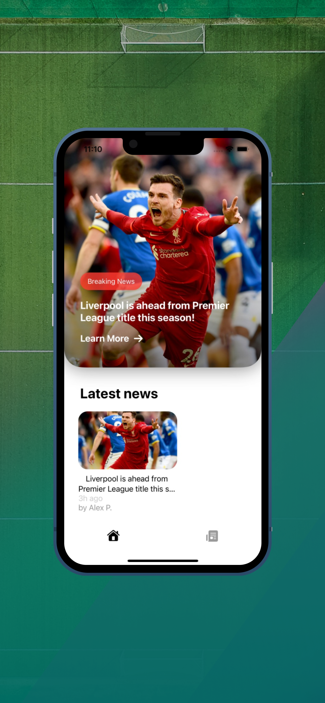

# PL-News-iOS
Premier League News app in iOS

This repository contains the full source code for PL News, an iOS sports news app for each user enjoys to watch the Premier League.

PL News - Blog

Supported Teams:
- Man City
- Liverpool
- Chelsea
- Man Utd
- Leicester City
- Aston Villa

#### App Screenshots

<table>
    <tr>
        <td></td>
        <td></td>
        <td></td>
    </tr>
    <tr>
        <td></td>
        <td></td>
        <td></td>
    </tr>
    <tr>
        <td></td>
        <td></td>
        <td></td>
    </tr>
    <tr>
        <td></td>
        <td></td>
        <td></td>
    </tr>
    <tr>
        <td></td>
        <td></td>
        <td></td>
    </tr>
    <tr>
        <td></td>
        <td></td>
        <td></td>
    </tr>
</table>

