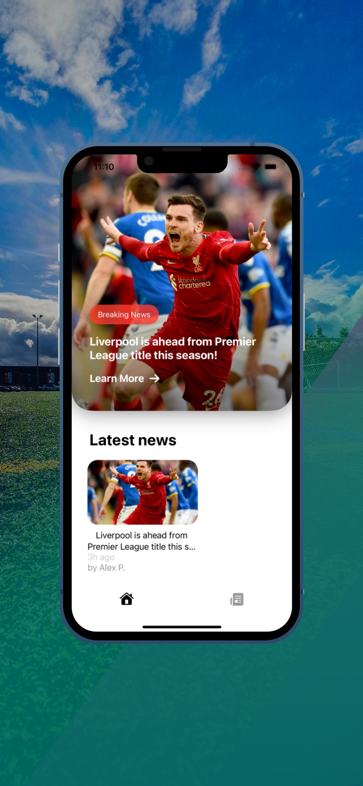
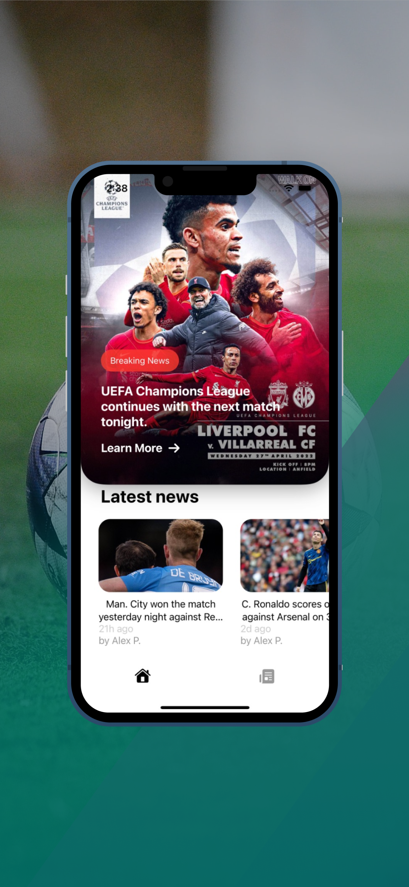

# PL-News-iOS
Premier League News app in iOS

This repository contains the full source code for PL News, an iOS sports news app for each user enjoys to watch the Premier League.

Premier League: Football News - PL News is the only football app you need to stay update and follow with the latest Premier League and European football news and stats.

Premier League: Football News - PL News is the only football app you need to stay update and follow up with the latest Premier League and European football news, transfer news, rumours, statistics, and follow back the latest football news, videos, next fixtures, and final scores around the globe.

ALL PREMIER LEAGUE NEWS IN THIS MOBILE APP

All you need to know about the Premier League: scores, latest news, breaking news, fixtures, results, stats, lineups with great animations from the best league in the European football and worldwide.

ALL TEAMS IN THIS ENGLISH COMPETITION

Supported Teams:
- Man City
- Liverpool
- Chelsea
- Man Utd
- Leicester City
- Aston Villa
- Brentford
- Newcastle
- Burnley
- Leeds Utd
- Crystal Palace
- Wolves
- Everton
- Watford
- Southampton

Stay in touch and share your feedback with us!
Email: hello@bluming.ai
Twitter: @BluminG_ai
Instagram: bluming.ai
GitHub: BluminG-ai

#### App Screenshots

<table>
    <tr>
        <td></td>
        <td></td>
        <td></td>
    </tr>
    <tr>
        <td></td>
        <td></td>
        <td></td>
    </tr>
    <tr>
        <td></td>
        <td></td>
        <td></td>
    </tr>
    <tr>
        <td></td>
        <td></td>
        <td></td>
    </tr>
    <tr>
        <td></td>
        <td></td>
        <td></td>
    </tr>
    <tr>
        <td></td>
        <td></td>
        <td></td>
    </tr>
</table>

